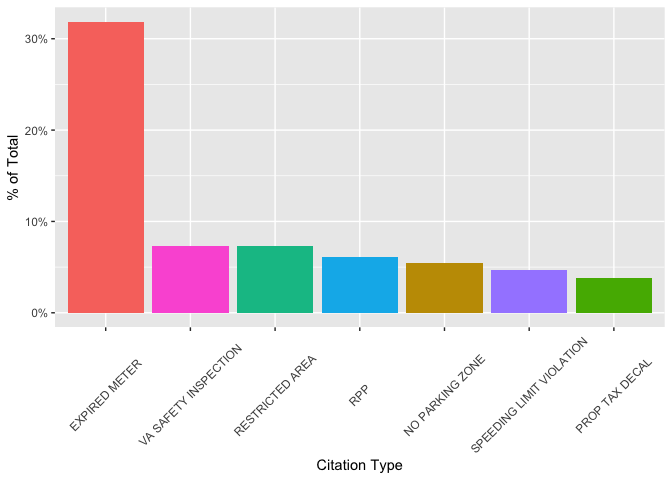
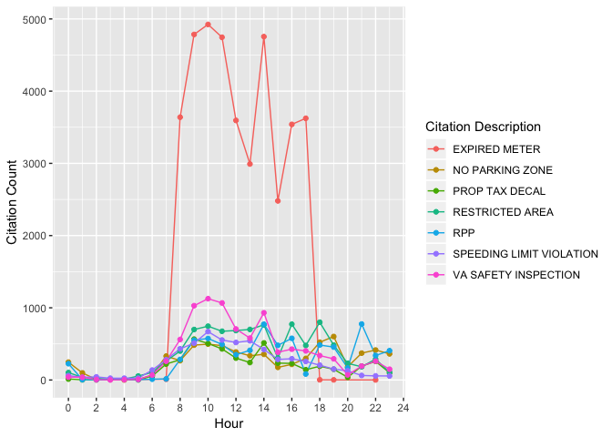

Arlington County Traffic Summons and Parking Citation Analysis
================
Matthew Harris
11/25/2018

-   [Introduction](#introduction)
-   [Analysis Goals](#analysis-goals)
-   [Data Sources](#data-sources)
-   [Data Import](#data-import)
-   [Data Wrangling/Cleansing](#data-wranglingcleansing)
    -   [Data Inspection](#data-inspection)
    -   [Data Type Updates](#data-type-updates)
    -   [Missing Data](#missing-data)
    -   [Data Characteristics](#data-characteristics)
-   [Data Transformation](#data-transformation)
-   [Analysis](#analysis)
    -   [Top Citations](#top-citations)
    -   [Citation Distribution Over Time](#citation-distribution-over-time)
    -   [Citation Locations - Missing Data](#citation-locations---missing-data)
    -   [Citation Locations - Most Common](#citation-locations---most-common)
-   [R Shiny Application](#r-shiny-application)

Introduction
------------

This will be used as a sample to display some of my analytical capabilities in R. This project will focus on demonstrating how useful R can be to perform analysis that is easy to reproduce and communicate. This is by no means an exhaustive demonstration of my proficiency with R, but should highlight common data analysis functions that I perform regularly.

Analysis Goals
--------------

Parking citations are never fun, but analyzing them could be. In this exploratory analysis I will examine the data to determine what types of citations are recorded the most, and if there are any discernible patterns over different time frames. I will refer to both parking citations and traffic summons as citations for the remainder of the analysis. It is important to note that since this data was only collected on vehicles that received citations I have no means of accurately predicting the probability of future outcomes.

This project will also include a Shiny application that will allow users to filter and segment the data without having to interact with the underlying code. Feel free to play with the application first and return to this document to see my process of cleaning and analyzing the data. [Shiny Application](https://mhdemo7.shinyapps.io/Citation_Analysis_Shiny/)

Let's dig in :)

Data Sources
------------

The traffic summons and parking citations data that I will be using are for Arlington County, Virginia. This data can be found on the Arlington County [website](https://data.arlingtonva.us/datasets/183803/traffic-summons-and-parking-citations/).

Data Import
-----------

Loading necessary packages for analysis.

``` r
library(lubridate)
library(scales)
library(GGally)
library(tidyverse)
```

Loading csv file containing the data.

``` r
citation_data <- read_csv("Raw Data/Traffic Summons and Parking Citations.csv")
```

Data Wrangling/Cleansing
------------------------

### Data Inspection

In order to begin the wrangling/cleansing process I need to know the characteristics of the data.

``` r
summary(citation_data)
```

    ##  TicketDateTime     TicketChargeDescription   Address         
    ##  Length:122757      Length:122757           Length:122757     
    ##  Class :character   Class :character        Class :character  
    ##  Mode  :character   Mode  :character        Mode  :character  
    ##    Location            Source         
    ##  Length:122757      Length:122757     
    ##  Class :character   Class :character  
    ##  Mode  :character   Mode  :character

### Data Type Updates

The first thing that stands out is that the `TicketDateTime` variable is classified as `character`. I will need to change that variable to be classified as `POSIXct` in order to determine when certain events occurred. I will also change all variables names to lower case.

``` r
citation_data %>%
  mutate_at(1, mdy_hms) -> citation_data

citation_data %>%
  colnames() %>%
  tolower() -> colnames(citation_data)
```

### Missing Data

Since all of the other variables are classified as `character` they don't display any NA information in the `summary` function. I can summarize the data to determine if NAs are present and how many.

``` r
str(citation_data)
```

    ## Classes 'tbl_df', 'tbl' and 'data.frame':    122757 obs. of  5 variables:
    ##  $ ticketdatetime         : POSIXct, format: "2017-07-01 00:16:00" "2017-07-01 00:21:00" ...
    ##  $ ticketchargedescription: chr  "NO PARKING ZONE" "RPP" "RPP" "RPP" ...
    ##  $ address                : chr  "1200 N HUDSON ST" "1300 N IRVING ST" "1300 N IRVING ST" "1300 N IRVING ST" ...
    ##  $ location               : chr  NA NA NA NA ...
    ##  $ source                 : chr  "Parking Citation" "Parking Citation" "Parking Citation" "Parking Citation" ...

``` r
citation_data %>%
  select(everything()) %>%
  summarize_all(funs(sum(is.na(.))))
```

    ## # A tibble: 1 x 5
    ##   ticketdatetime ticketchargedescription address location source
    ##            <int>                   <int>   <int>    <int>  <int>
    ## 1              0                       0   23536    99269      0

There appears to be a lot of missing data for the `address` and `location` variables. The data set is still viable for analysis as the other variables don't contain NAs. I can also see from the `str` function that the `address` variable contains street addresses. The first couple of `location` observations are NA so I will need to use a different summary operation to see what this variable holds.

``` r
citation_data %>%
  filter(!is.na(location)) %>%
  select(location)
```

    ## # A tibble: 23,488 x 1
    ##    location                                 
    ##    <chr>                                    
    ##  1 -722                                     
    ##  2 38.8844760460000000  -77.0929493950000000
    ##  3 -722                                     
    ##  4 38.8844703350000000  -77.0986130960000000
    ##  5 38.8871055580000000  -77.0952085300000000
    ##  6 38.8882261910000000  -77.0835202630000000
    ##  7 38.8533398800000000  -77.0552776250000000
    ##  8 38.8865002170000000  -77.0830921850000000
    ##  9 38.8800109260000000  -77.1138481280000000
    ## 10 -722                                     
    ## # ... with 23,478 more rows

``` r
citation_data %>%
  select(source) %>%
  distinct()
```

    ## # A tibble: 2 x 1
    ##   source          
    ##   <chr>           
    ## 1 Parking Citation
    ## 2 Traffic Summon

The `location` variable appears to hold longitude and latitude data for the location of the citation. This data would be interesting to use but it looks as though some observations only have one location parameter. There are other methods for determining geographical location using street addresses that can be used. The `source` variable identifies whether the observation is for a parking citation or traffic summon. This could be useful for filtering later in the analysis. <br />

### Data Characteristics

Now that all of the variables have been examined I can look at the `ticketdatetime` variable again to determine the date range of the data.

``` r
summary(citation_data)
```

    ##  ticketdatetime                ticketchargedescription   address         
    ##  Min.   :2017-07-01 00:16:00   Length:122757           Length:122757     
    ##  1st Qu.:2017-10-02 19:16:00   Class :character        Class :character  
    ##  Median :2017-12-18 13:50:00   Mode  :character        Mode  :character  
    ##  Mean   :2017-12-25 03:48:48                                             
    ##  3rd Qu.:2018-03-23 08:59:00                                             
    ##  Max.   :2018-06-23 23:50:00                                             
    ##    location            source         
    ##  Length:122757      Length:122757     
    ##  Class :character   Class :character  
    ##  Mode  :character   Mode  :character  
    ##                                       
    ##                                       
    ## 

The observations appears to have occurred over almost an entire calendar year. Hopefully this will allow me to determine if there were any seasonal patterns that occurred in that time frame.

Data Transformation
-------------------

My next step is to create new variables to examine the data at different time frames other than an exact date and time.

``` r
citation_data %>%
  mutate(ticket_hour = hour(ticketdatetime), ticket_day = day(ticketdatetime),
         ticket_weekday = weekdays(ticketdatetime),
         ticket_month = month(ticketdatetime)) -> citation_data
```

Analysis
--------

Now that the data has been cleaned and transformed I can begin to answer some of my initial questions. First up what type of citation is most common from the data?

### Top Citations

The first block of code below tells me that there are 254 different citation types recorded. With that many unique types I decided to filter the data for the top 7 in term of number of citations recorded. Expired meter citations make up nearly 32% of the whole data set with safety inspection violations coming in at second with a little over 7%. It's clear that expired meter citations are the bread and butter of Arlington County traffic police. Further analysis can be done to determine why these are so much more common.

``` r
citation_data %>%
  select(ticketchargedescription) %>%
  distinct() %>%
  count()
```

    ## # A tibble: 1 x 1
    ##       n
    ##   <int>
    ## 1   254

``` r
citation_data %>%
  group_by(ticketchargedescription) %>%
  summarize(ticket_type_count = n()) %>%
  ungroup() %>%
  mutate(ticket_type_perc = ticket_type_count/sum(ticket_type_count)) %>%
  arrange(desc(ticket_type_count)) %>%
  head(7) -> top_ticket_types
top_ticket_types
```

    ## # A tibble: 7 x 3
    ##   ticketchargedescription  ticket_type_count ticket_type_perc
    ##   <chr>                                <int>            <dbl>
    ## 1 EXPIRED METER                        39097           0.318 
    ## 2 VA SAFETY INSPECTION                  8946           0.0729
    ## 3 RESTRICTED AREA                       8924           0.0727
    ## 4 RPP                                   7470           0.0609
    ## 5 NO PARKING ZONE                       6717           0.0547
    ## 6 SPEEDING LIMIT VIOLATION              5782           0.0471
    ## 7 PROP TAX DECAL                        4668           0.0380

``` r
top_ticket_types %>%
  ggplot(aes(reorder(ticketchargedescription, -ticket_type_perc), ticket_type_perc, fill = factor(ticketchargedescription))) + 
  geom_col() + theme(axis.text.x = element_text(angle = 45, vjust = 0.5), legend.position = "none") + 
  labs(x = "Citation Type", y = "% of Total") + scale_y_continuous(labels = percent)
```



### Citation Distribution Over Time

Now that we know what the top citation types are lets see when they occur throughout a day. I decided to visualize this information with a point/line plot, but a similar output could have been created with a histogram.

``` r
top_ticket_types %>% pull(ticketchargedescription) -> top_ticket_vector

citation_data %>%
  filter(ticketchargedescription %in% top_ticket_vector) %>%
  group_by(ticket_hour, ticketchargedescription) %>%
  summarize(ticket_hour_count = n()) %>%
  ungroup() %>%
  ggplot(aes(ticket_hour, ticket_hour_count, col = factor(ticketchargedescription))) + geom_line() + 
  geom_point() + scale_x_continuous(breaks = seq.int(0, 24, 2)) + labs(x = "Hour", y = "Citation Count") +
  scale_color_discrete(name = "Citation Description")
```



A quick glance at the graph shows us that citations seem to spike around 10:00 AM and 2:00 PM for nearly all of the types shown. It's also clear that there are sharp drop offs early in the morning and late at night. The RPP(Residential Permit Parking) citations seem to spike at 9:00 PM which make sense considering that is when most residential areas begin looking for parking violators.

### Citation Locations - Missing Data

Lets now examine where the citations were given the most. We learned earlier that there are 23,536 observations that don't include `address` data. We can examine this data first to determine a reason for these missing data points.

``` r
citation_data %>%
  filter(is.na(address)) %>%
  group_by(ticketchargedescription, address) %>%
  summarize(n = n()) %>%
  ungroup() %>%
  mutate(perc_na = n/sum(n)) %>%
  arrange(desc(n)) -> address_na
address_na
```

    ## # A tibble: 212 x 4
    ##    ticketchargedescription                     address     n perc_na
    ##    <chr>                                       <chr>   <int>   <dbl>
    ##  1 SPEEDING LIMIT VIOLATION                    <NA>     5782  0.246 
    ##  2 TRAFFIC:FAIL TO OBEY LAWFULLY ERECTED SIGNS <NA>     4127  0.175 
    ##  3 OPERATE UNREGISTERED VEHICLE                <NA>     1753  0.0745
    ##  4 TRAFFIC:IMPROPER RIGHT TURN ON RED          <NA>     1152  0.0489
    ##  5 NO DRIVERS LICENSE                          <NA>      978  0.0416
    ##  6 TRAFFIC:FAIL TO OBEY TRAFFIC LIGHTS         <NA>      754  0.0320
    ##  7 TRAFFIC:EXPIRED REJECTION STICKER           <NA>      657  0.0279
    ##  8 DRIVING W/SUSPENDED OR REVOKED LICENSE      <NA>      634  0.0269
    ##  9 SPEED: BUSINESS/RESIDENTIAL AREA            <NA>      613  0.0260
    ## 10 TRAFFIC: FAIL TO STOP/YIELD                 <NA>      583  0.0248
    ## # ... with 202 more rows

A quick summary function shows us that 72% of the NA location observations are related to speeding and traffic related citations. It's likely that the officers giving out the citations didn't have time to record where they occurred. Either way we now know that none of the top citation types are missing `address` data.

### Citation Locations - Most Common

Running the opposite of the previous summary function shows us the top locations where citations were received.

``` r
citation_data %>%
  filter(!is.na(address)) %>%
  group_by(address) %>%
  summarize(n = n()) %>%
  ungroup() %>%
  mutate(perc_na = n/sum(n)) %>%
  arrange(desc(n))
```

    ## # A tibble: 8,449 x 3
    ##    address                  n perc_na
    ##    <chr>                <int>   <dbl>
    ##  1 1400 COURTHOUSE RD N  2761 0.0278 
    ##  2 1200 S HAYES ST       2174 0.0219 
    ##  3 500 12TH ST S         1136 0.0114 
    ##  4 300 12TH ST S          704 0.00710
    ##  5 200 23RD ST S          695 0.00700
    ##  6 MTC                    694 0.00699
    ##  7 900 N TAYLOR ST        579 0.00584
    ##  8 2000 15TH ST N         574 0.00579
    ##  9 2000 14TH ST N         569 0.00573
    ## 10 3200 FAIRFAX DR.       561 0.00565
    ## # ... with 8,439 more rows

1400 COURTHOUSE RD N is the address with the most citations. A quick Google Maps search lets us know that a large parking lot is located at that address. I could also use the `ggmap` package to automate this address look-up process, but recent changes to Google's Maps Static API have made that difficult.


R Shiny Application
-------------------

So far I have created tables and visualizations that are based on particular criteria. There are numerous ways to slice this data set within R but having dynamic plots would make my exploratory analysis easier. I can share my findings by creating a Shiny application that anyone can be utilized by anyone, regardless of their experience with R.<br /> [Shiny Application](https://mhdemo7.shinyapps.io/Citation_Analysis_Shiny/)

``` r
rm(address_na)
save.image(file = "citation_data_tidy.RData")
```
